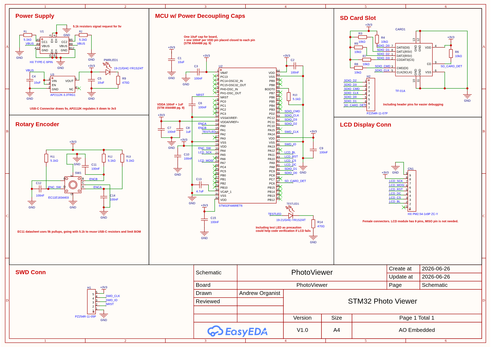

# STM32 Photo Viewer
A picture-frame-like embedded display that renders photos from a micro SD card.

Firmware written 100% by hand from scratch. ✍️
- ❌ no generated code
- ❌ no 3rd party frameworks or libraries (*see note below)
- ❌ no vendor hardware abstraction layer (HAL), not even CMSIS headers
- ✅ Linker script, vector table, reset handler, clock trees, all manual
- ✅ GPIO, SPI, SDIO, TIMER, DMA drivers from the ground up
- ✅ Custom lightweight graphics rendering for the GUI
- ✅ Hand-rolled SD card driver with a minimal FAT32 implementation

And for the physical device:
- ✅ Custom PCB design (with EasyEDA + JLCPCB as manufacturer)
- ✅ Homemade, 3D printed case (on a Bambu Labs A1 mini)

*Note: the `convert.py` utility script under `/tools` does rely on a couple python libraries, but this runs on a PC and is separate from the firmware.
See the Loading Photos section below for more info.

## Hardware
- STM32F446RE (32-bit Arm Cortex M4 processor) MCU
- 3.5" TFT LCD display w/ ST7796 controller
- EC11 rotary encoder
- SD card slot

## Schematics

## Requirements
1. [GNU Arm Embedded Toolchain](https://developer.arm.com/downloads/-/gnu-rm)
2. [GNU Make](https://www.gnu.org/software/make/)
3. [Bear](https://github.com/rizsotto/Bear) (for clangd compile_commands generation)
4. [UV Python package & project manager](https://docs.astral.sh/uv/) (used for conversion script)

## Loading Photos
A modern, high capacity micro SD card is required for the firmware.
The card must be pre-formatted to contain a FAT32 filesystem located at the 1st partition.

The firmware also expects photos in a custom '.pic' file format.

A convenient photo conversion script is included under `tools/convert.py`.

See the tool [README](tools/README.md) for more details.

## Local Dev Setup
1. Run `make setup` to generate the clangd compile commands for your IDE.
